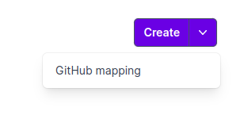

# Components

* [`ButtonWithMenu`](#buttonwithmenu)

## `ButtonWithMenu`

### Look



### Code

```html
<script setup>
import { Link } from '@inertiajs/vue3';
import {__, route} from "@/functions";
import ButtonWithMenu from "@/Components/ButtonWithMenu.vue";
import {MenuItem} from "@headlessui/vue";
</script>

<template>
    <ButtonWithMenu :title="__('Create')" color="primary">
        <MenuItem v-for="type in types" :key="type.key" v-slot="{ active }">
            <Link :href="route(`/${user.slug}/_mappings/create`, {type: type.key})" :class="[active ? 'bg-gray-100 text-gray-900' : 'text-gray-700', 'block px-4 py-2 text-sm']">
                {{ __(':type mapping', {type: type.name}) }}
            </Link>
        </MenuItem>
    </ButtonWithMenu>
</template>
```

### Props

* `title` - text on the button.
* `color` - button color. Can be `primary` or null.
